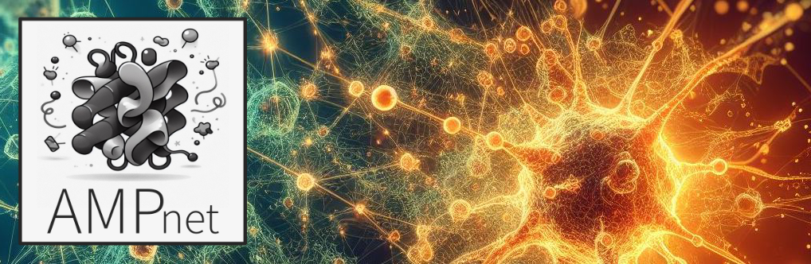
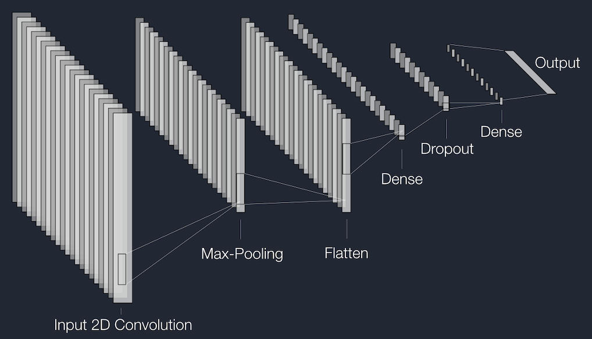
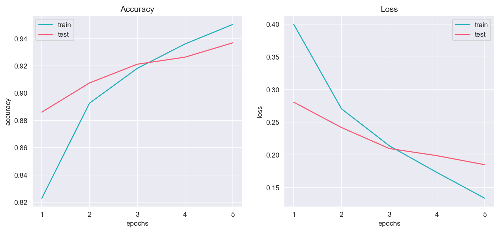
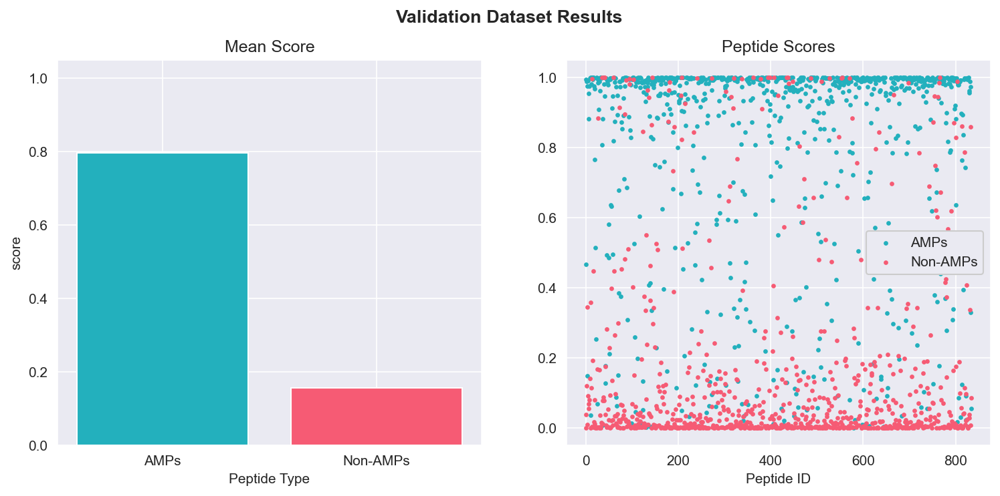
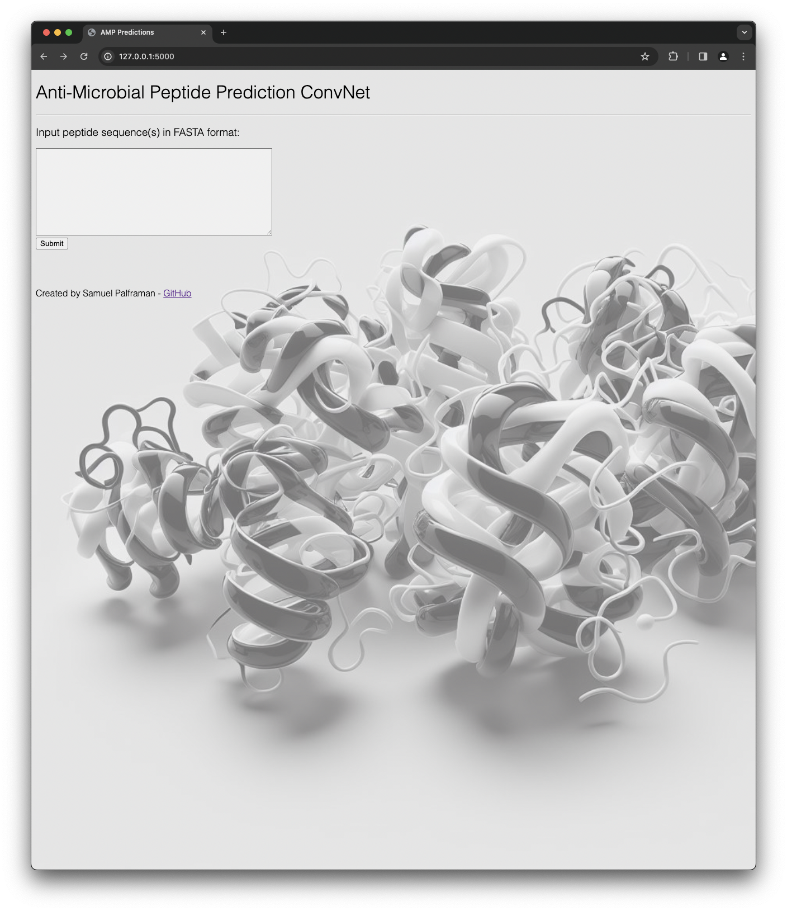
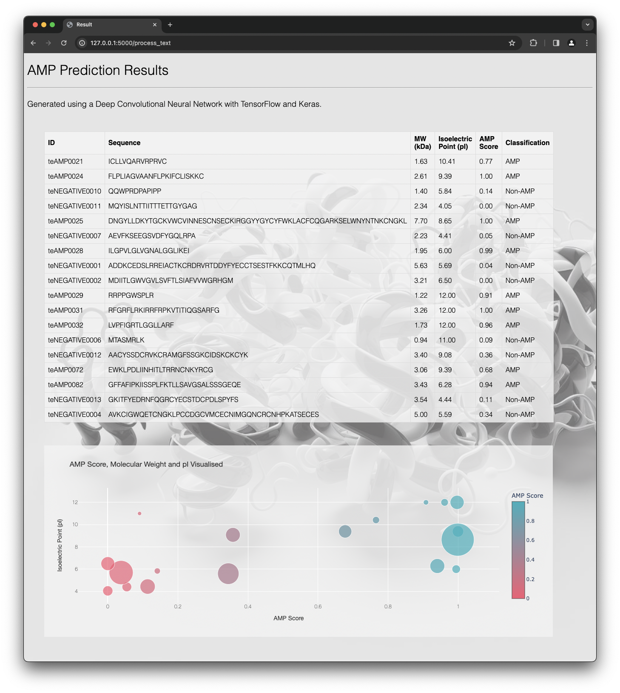

# AMPnet: Antimicrobial Peptide Prediction
A TensorFlow and Keras deep Convolutional Neural Network (CNN) that identifies Antimicrobial Peptides (AMPs) based on amino acid sequences.

Created and submitted as the final project for Monash University Data Analytics Boot Camp (November 2023). 




## Preface

Antibiotic-resistant bacteria have emerged as one of the greatest threats to human health globally. By the year 2050, there will be more deaths attributed to antibiotic-resistant bacterial infections than cancer each year. Our overuse and over-reliance on antibiotics has, over time, dramatically reduced their effectiveness and efficacy ([Murray et al. 2022](https://www.sciencedirect.com/science/article/pii/S0140673621027240?pes=vor)). As such, the development of new and alternative antimicrobial therapies is essential to human health long-term. 

Antimicrobial peptides (AMPs) possess broad-spectrum antimicrobial properties and are considered a promising substitute for current antibiotics ([Xuan et al. 2023](https://www.sciencedirect.com/science/article/pii/S1368764623000377#bib84)). However, screening unknown and/or putative AMPs in wet laboratories can be time consuming, expensive and difficult to implement large scale. An alternative and more rapid approach is to use deep neural network machine learning to identify peptides that possess antimicrobial properties based on various features. 

This project uses a deep Convolutional Neural Network model to classify peptides as AMPs or Non-AMPs based on amino acid sequence. 

## Table of Contents

- [Instructions](#instructions)
- [General info](#general-info)
- [Technologies](#technologies)
- [Screenshots](#screenshots)
- [Code example](#code-example)
- [Repository structure](#repository-structure)
- [References](#references)

## Instructions

- Use [AMPnet](https://antimicrobial-neural-network-app-palframan.streamlit.app) hosted by Streamlit; or

- Run on your own computer:

  1. Download Repository.

  2. Using Mac/Linux Terminal or Windows WSL Command Prompt:

     - Install Python libraries listed in [Technologies](#technologies).

     - Change working directory to newly downloaded Repository folder (`path/to/antimicrobial-neural-network-main`).

     - Run `app.py` file.

  3. Open Browser and navigate to: `http://127.0.0.1:5000/`

  4. Input FASTA amino acid sequence.

## General info

### AMPnet_data_compilation.ipynb

- Reads in `FASTA` files and converts data to Python `Pandas` DataFrames using `Biopython` library.
- Creates new `Anti_Microbial` Column for each DataFrame and assigns `1` for AMPs and `0` for Non-AMPs.
- Concatenates all Training and Test DataFrames into `peptides_df` DataFrame to Train and Test the AMPnet Model.
- Creates Validation DataFrame from separate and independent datasets for an extra Validation step. 
- Creates new `Sequence_Length` Column and calculates the number of amino acid residues of each peptide.
- Calculates Kyte-Doolittle scores for each amino acid in each peptide sequence and appends data as new Column (`KD_Scores`) to DataFrame.
- Exports DataFrames as `CSV` files:
  - `peptides_df` as `peptides.csv` for Training and Testing
  - `validation_df` as `validation.csv` for additional AMPnet Model Validation.
  - `validation_positive.csv` and `validation_negative.csv` files were also generated to facilitate additional Validations.


### AMPnet_deep_learning.ipynb

- `One-Hot-Encodes` amino acid sequences into 2D Matrix of binary values to facilitate Convolutional Neural Network modelling.

- Normalises Training and Testing data by `Padding` all 2D Matrices to 198 rows (i.e 198 amino acids), the largest peptide in the Training and Testing dataset.

- Splits Feature (X) and Label (y) into Training and Test data using `train_test_split()` module from machine learning library `scikit-learn`:
  - Training data (75 % of the total dataset):
    - `X_train`: Features data used to train the model.
    - `y_train`: Labels data used to train the model.
  - Test Data (25 % of the total dataset):
    - `X_test`: Features data used to test the model.
    - `y_test`: Labels data used to tes the model.

- Converts input data into `NumPy Array`.

- Defines `TensorFlow Keras` Convolutional model. 

- **Simplified LeNet Diagram**:

  

- Compiles Model with `binary_crossentropy` loss handling and `adam` optimizer using `accuracy` as metric.

- Trains and Tests the Model with `epochs = 5`.

- **Accuracy and Loss of Train and Test data**:

  

- Test Accuracy: `93.69 %` / Test Loss: `0.18`

### AMPnet_deep_learning_validation.ipynb

- Reads in `CSV` files as Pandas DataFrames.

- `One-Hot-Encodes` amino acid sequences into 2D Matrix of binary values as described above.

- `Pads` all 2D Matrices to 198 rows as described above. 

- Converts input data to `Numpy Arrays`.

- Loads Trained AMPnet TensorFlow and Keras Model.

- Makes Predictions on Validation datasets.

- Generates and visualises `Confusion Matrix` to assess `True Positives, False Positives, True Negatives and False Negatives`.

- Generates `Classification Report` to assess `Precision, Recall, F1-score and Accuracy`.

- Visualises Validation dataset that contained discrete positive (AMP) and negative (Non-AMP) sequences.

- **Putative and Confirmed AMP / Non-AMPs predicted by AMPnet**:

  *score > 0.5 = AMP | score < 0.5 = Non-AMP*
  
  

### AMPnet_functions.py

- Defines **Functions** called in Python Flask file (`app.py`):
  - `process_fasta(user_input)`: parses FASTA Input from user and converts it to Pandas DataFrame.
  - `bin_aa(sequence)`: bins Amino Acids based on Amino Acid Murphy 8 categories (unused in final version).
  - `calc_molecular_weight(sequence)`: calculates Molecular Weights (in kDa) of Amino Acid Sequences (as pd.Series).
  - `list_hydrophobicities(sequence)`: lists Kyte-Doolittle scores for each amino acid in sequence.
  - `calculate_pI(sequences)`: calculates Isoelectric Point (pI) of Amino Acid Sequence (as pd.Series).
  - `one_hot_encode(sequence)`: One-Hot Encodes Amino Acid Sequence.
  - `pad_arrays(arr_list, desired_len)`: Pads One-Hot-Encoded Array Sequences.
  - `create_bubble_chart(df)`: creates Plotly Bubble Chart to visualise AMP Score, MW and pI in results.html.


### app.py

- Takes `FASTA Input sequence(s)` from User via `index.html`.
- Serves Input data to `/process_text` app route where all Functions in `AMP_functions.py` are called.
- Returns `results_df` DataFrame and `results_df` Bubble Chart to `result.html` page.
- Catches errors and renders `error.html` if input from user is not a valid FASTA amino acid sequence.

### Index.html

- Landing page of website and accepts input data from user.

### result.html

- Renders `results_df` DataFrame
- Renders Plotly Bubble Chart to visualise the AMP Score, Molecular Weight and Isoelectric Point of each peptide.

### error.html

- Renders when user inputs invalid FASTA sequence.
- Provides an example of a correct FASTA sequence.

### style.css

- Contains custom formatting for `index.html`, `result.html` and `error.html`.

### AMPnet_model_summary.md

- Summarises model architecture.
- Details optimisations made to model.
- Analyses model performance.
- Details potential future optimisations to improve the model.

### Python Folder

- Contains all `.ipynb` and `.py` files (except `app.py`)

### HDF5_files Folder

- Contains the trained `convolutional_nn_1.h5` AMPnet Model File.

### static Folder

- Contains `style.css` and background image for `html` files.

### templates Folder

- Contains `index.html`, `result.html` and `error.html` files.

### Resources Folder

- Contains data used to Train, Test and Validate the Model.
- Contains Images of Code, Charts and Model Diagrams.

## Technologies

Project created and run using:

- Python 3.10.9
  - Pandas 1.5.3
  - NumPy 1.24.3
  - Biopython 1.78
  - Matplotlib 3.7.1
  - Plotly 5.9.0
  - Seaborn 0.12.2
  - Scikit-Learn 1.3.0
  - TensorFlow 2.14.0
  - Flask 2.2.2
- Visual Studio Code 1.83.0


## Screenshots

**Landing Page**

**Results Page**

## Code example

```python
## Code Snippet from AMPnet_deep_learning.ipynb
#################################################

# Build Convolutional Neural Network
model = tf.keras.models.Sequential()

# Add 2D Convolutional Layer
model.add(tf.keras.layers.Conv2D(32, kernel_size=(3, 3), activation='relu', input_shape=(198, 20, 1)))

# Add Max-Pooling Layer
model.add(tf.keras.layers.MaxPooling2D(pool_size=(2, 2)))

# Flatten Feature Map
model.add(tf.keras.layers.Flatten())

# Add Dense Layer
model.add(tf.keras.layers.Dense(128, activation='relu'))

# Hyperparameter Tuning (drops Neurons during Training to reduce Overfitting)
model.add(tf.keras.layers.Dropout(0.5))

# Add Dense Layer
model.add(tf.keras.layers.Dense(64, activation='relu'))

# Add Output Layer
model.add(tf.keras.layers.Dense(1, activation='sigmoid'))

# Check the structure of the model
model.summary()

# Compile Model
model.compile(loss='binary_crossentropy', optimizer='adam', metrics=['accuracy'])

# Train Model
model_fit = model.fit(X_train, y_train, epochs=5, validation_data=(X_test, y_test))
```

## Repository structure

```
anti-microbial-neural-network
│
├── AMPnet_model_summary.md
├── HDF5_files
│   └── convolutional_nn_1.h5
├── Python
│   ├── AMPnet_data_compilation.ipynb
│   ├── AMPnet_deep_learning.ipynb
│   ├── AMPnet_deep_learning_validation.ipynb
│   └── AMPnet_functions.py      
├── README.md
├── Resources
│   ├── AMPlify_AMP_test_common.fa
│   ├── AMPlify_non_AMP_test_balanced.fa
│   ├── Images
│   │   ├── AMP_CNN_LeNet.png
│   │   ├── AMP_CNN_structure.png
│   │   ├── ampnet_logo.png
│   │   ├── classification_report.png
│   │   ├── confusion_matrix.png
│   │   ├── convnet_banner.jpg
│   │   ├── convnet_banner_logo.png
│   │   ├── index_screenshot.png
│   │   ├── model_structure.png
│   │   ├── result_screenshot.png
│   │   ├── training_10_epochs.png
│   │   ├── training_5_epochs_&_dropout.png
│   │   └── validation_5_epochs_&_dropout.png
│   ├── db90_negativeamp.fasta
│   ├── db90_positiveamp.fasta
│   ├── peptides.csv
│   ├── test_negative_3528.fasta
│   ├── test_postive_3528.fasta
│   ├── train_negative_final.fasta
│   ├── train_positive_final.fasta
│   ├── validation.csv
│   ├── validation_negative.csv
│   └── validation_positive.csv
├── app.py
├── static
│   └── css
│       ├── ampnet_logo.png
│       ├── b_and_white_protein.png
│       └── style.css
└── templates
    ├── error.html
    ├── index.html
    └── result.html
```

## References

- **Data Collation**:
  - Training and Testing data:
    - [Co-AMPpred - Singh et. al. 2021](https://bmcbioinformatics.biomedcentral.com/articles/10.1186/s12859-021-04305-2) 
    - [AI4AMP - Lin et al. 2021](https://pubmed.ncbi.nlm.nih.gov/34783578/)
  
  - Validation data:
    - [AMPlify - Li et al. 2022](https://bmcgenomics.biomedcentral.com/articles/10.1186/s12864-022-08310-4)
  
- **LeNet Diagram generation**:
  - [NN-SVG - LeNail 2019](https://web.archive.org/web/20190428110423id_/https://www.theoj.org/joss-papers/joss.00747/10.21105.joss.00747.pdf)
- Code, where appropriate, was adapted from Monash University Data Analytics Boot Camp 2023 course learning material.

Created and written by Samuel Palframan - November 2023.
